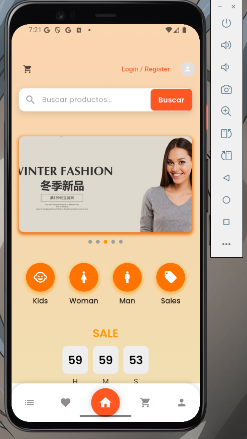
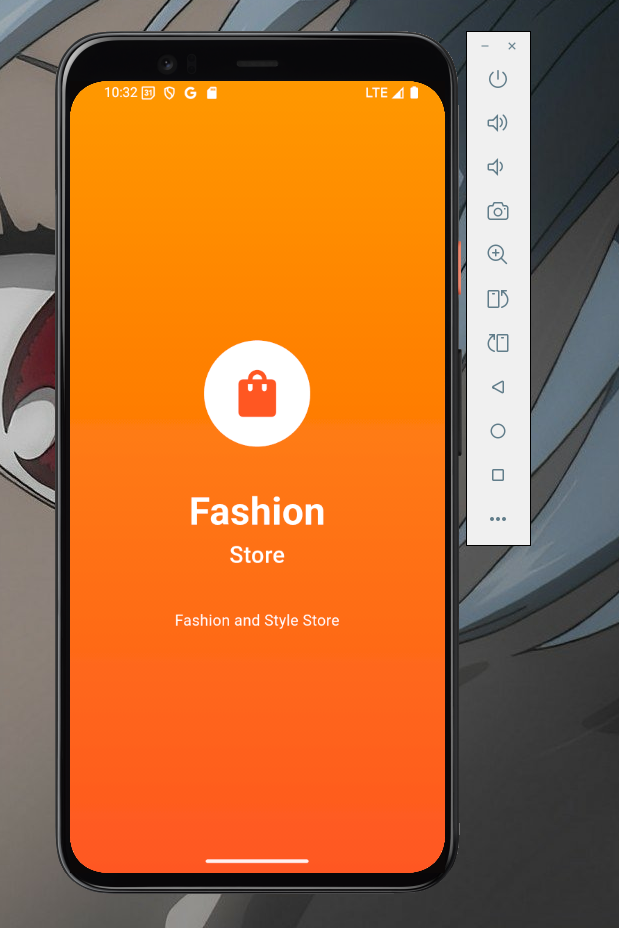
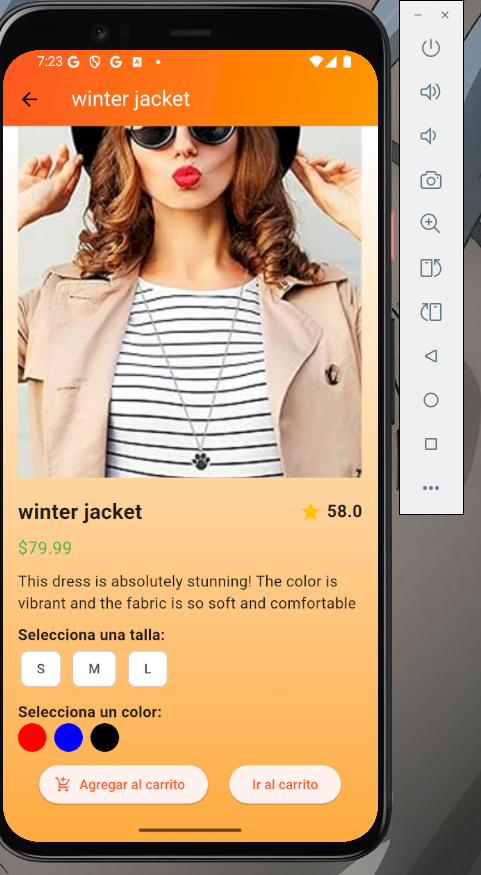
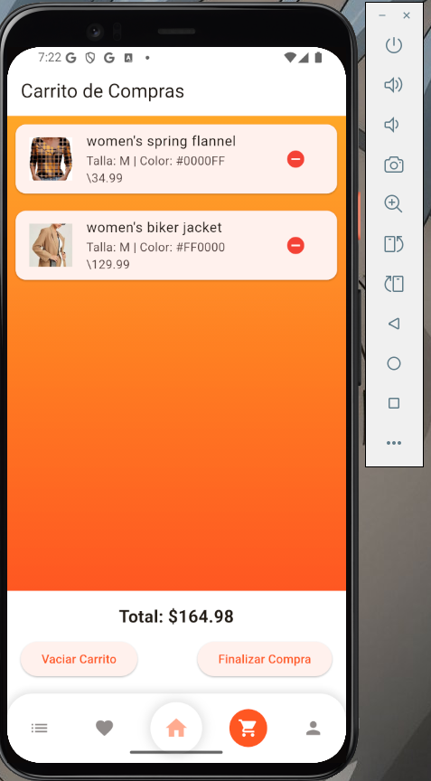

# Ecomerce 

 




 



## Getting Started

This project is a starting point for a Flutter application.

A few resources to get you started if this is your first Flutter project:

- [Lab: Write your first Flutter app](https://docs.flutter.dev/get-started/codelab)
- [Cookbook: Useful Flutter samples](https://docs.flutter.dev/cookbook)

For help getting started with Flutter development, view the
[online documentation](https://docs.flutter.dev/), which offers tutorials,
samples, guidance on mobile development, and a full API reference.


```bash
## ✨ Code-base structure

El proyecto viene con una estructura sencilla e intuitiva que se presenta a continuación:

< PROJECT ROOT TEST TECHNICAL>

TIENDA/
├── lib/
│   ├── main.dart
│   ├── screens/
│   │   ├── home_screen.dart
│   │   ├── screen1.dart
│   │   ├── screen2.dart
│   │   ├── screen3.dart
│   │   ├── screen4.dart
│   │   ├── splash_screen.dart
│   │
│   ├── widgets/
│   │   ├── custom_bottom_navigation_bar.dart
│   │   ├── carousel_widget.dart
│   │   ├── search_widget.dart
│   │   ├── product_grid_widget.dart
│   │
│   ├── utils/
│   │   ├── app_textstyles.dart
│   │   ├── app_themes.dart
│   │
│   ├── models/
│   │   ├── app_state.dart
│   │   ├── product_model.dart
│   │
│   ├── controllers/  
│   │   ├── auth_controller.dart       // Para login/logout
│   │   ├── cart_controller.dart       // Para manejar el carrito
│   │   ├── product_controller.dart    // Para cargar productos desde JSON
│   │
│   ├── assets/
│   │   ├── icons/
│   │   ├── images/
│   │   ├── dataProduct.json ************************************************************************

```

<br />